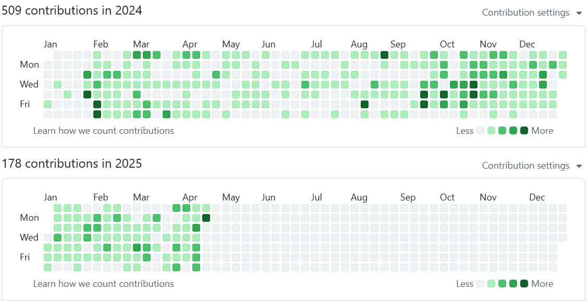

처음에는 방대한 IT 분야의 지식을 최대한 습득하고, 활용하기 위해서는 암기만으로는 불가능하다고 생각하여 개인 지식 저장 목적으로 기록을 시작했습니다. 2023년부터 기록을 이어가고 있으며 그날 있었던 일이나 생각, 공부한 지식 등을 작성하고 있습니다.

저는 제가 만든 결과물이 가능한 높은 품질을 갖길 원합니다. 이를 위해 계속 공부하고 있지만, 혼자 개발하는 것에는 생산 속도나, 고려하지 못한 문제 등의 한계가 있었습니다. 더 나은 형태의 결과물을 위해서는 각자 생각하고 있는 접근 방법이나 지식을 동료들과 공유하며 같은 목표를 위해 협업해야 합니다. 대화 없이 각자의 생각대로 개발한다면 서로 다른 목표를 상상하면서 생산성과 결과물의 품질이 낮아지고, 구성원 간의 갈등도 발생할 수 있습니다.

이를 피하기 위해서는 표현하는 것을 두려워하지 않고 자신의 생각을 표현해야 합니다. 개발 문서를 작성하는 것 역시 추상적인 내용으로 인해 생각의 차이가 발생할 수 있는 부분을 명확한 형태로 표현하여 구성원 간 목표를 맞추기 위함입니다.

제 스스로도 지금까지 작성한 지식을 혼자서 내재하는 것보다, 다른 사람들도 제 생각을 알 수 있게 표현하려고 합니다.

하지만 이전까지는 스스로 학습한 것을 기록하기 위한 목적이었기에 공유하기 위한 고민이 부족했습니다. 공개할 수 없는 정보가 함께 포함되어 있거나, 출처를 불분명하게 작성한 등 그대로 공유할 수 없는 문제가 있었습니다.

또한 작성하는 과정에서 원하는 정보를 보다 편리하게 찾고, 가독성을 향상하기 위한 작성 방법을 고민하며 글이나 디렉토리 구조를 바꿨습니다. 이 과정에서 글의 형태가 일관성이 없는 문제도 있었습니다.

지금부터는 작성한 글의 형태를 일관성 있게 맞추고, 개인 정보를 제거 후 출처를 명확하게 표기하여 블로그의 포스트 형태로 옮기려고 합니다. 글의 목적은 3가지로 나눴습니다:

- **IT 지식**: 공부한 IT 관련 지식을 이해하기 쉽도록 정리하여 작성합니다.
- **개발 회고**: 시스템을 구현하면서 접근 방법과 지표를 얻기 위한 방법, 판단 근거 등 고민했던 과정과 스스로 내린 결론을 작성합니다.
- **메모**: 개인적으로 공유하고 싶은 내용을 작성합니다.
