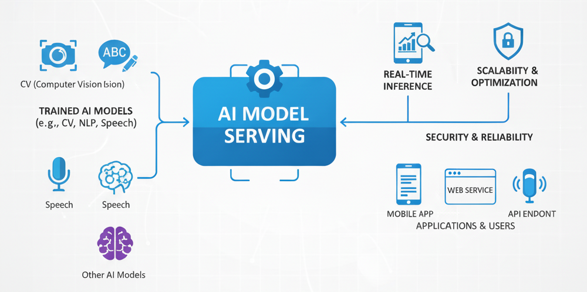

## 개요

인공지능(AI) 모델 서빙은 단순히 학습된 모델을 배포하는 단계를 넘어, AI의 가치를 실제 비즈니스 성과로 전환하는 핵심적인 공학 분야로 자리 잡았습니다. 모델 서빙의 본질적인 과제는 실제 운영 환경의 다양한 제약 조건 하에서 빠르고, 안정적이며, 비용 효율적인 예측 서비스를 제공하는 것입니다. 

이는 단순히 <u>모델을 API 뒤에 배치하는 것을 넘어, 분산 시스템, MLOps, 하드웨어 최적화 원칙을 통합하는 총체적인 접근을 요구</u>합니다. 성공적인 모델 서빙은 <u>예측의 품질뿐만 아니라, 예측이 전달되는 속도와 신뢰성, 그리고 이를 유지하는 데 드는 비용까지 모두 고려</u>하는 다차원적인 최적화 문제입니다.

이번 포스트에서는 모델 서빙이 어떻게 등장했고, 어떤 특징과 목표를 갖는지 알아보겠습니다.

## 모델 서빙의 발전

### 초기 배포: 스크립트와 사일로

초기 머신러닝 배포는 개발 과정의 마지막 단계에서 고려되는 부차적인 작업이었습니다. 데이터 과학자들은 훈련된 모델 결과물(예: `pickle` 파일)을 <u>엔지니어링 팀에 전달하는 방식으로 작업을 마무리</u>했습니다. 이 시기의 배포는 임시방편으로 작성된 스크립트, 수동 프로세스, 그리고 표준화되지 않은 환경의 조합으로 이루어져 여러 문제점을 내포하고 있습니다.

- **재현성 부족**: 일관되지 않은 환경과 수동적인 단계들은 모델이나 그 <u>예측 결과를 신뢰성 있게 재현하는 것을 거의 불가능</u>합니다.
- **확장성 문제**: 모델의 수와 데이터의 복잡성이 증가함에 따라 <u>수동 프로세스는 본질적으로 확장 불가능</u>합니다.
- **오류 위험 증가 및 비효율성**: 데이터 과학팀과 운영팀 간의 수동적인 인계 과정은 소통의 단절, 오류 발생 위험 증가, 그리고 느린 출시 주기로 이어졌습니다. 모델 개발과 소프트웨어 개발 사이의 간극은 주요 병목 현상의 원인이었습니다.

이러한 초기 단계의 어려움은 머신러닝이 학문적 탐구에서 실용적인 애플리케이션으로 전환하기 위한 배포에서 체계적이고 원칙에 기반한 접근법의 필요성을 절실하게 만들었다.

### MLOps: 철학적, 문화적 전환

MLOps는 개발(DevOps), 데이터(DataOps), 모델(ModelOps)을 통합하여 ML의 고유한 복잡성에 맞춰 CI/CD(지속적 통합/지속적 배포), 버전 관리, 자동화와 같은 DevOps 원칙을 적용합니다. 코드뿐만 아니라 데이터와 모델을 일급 시민(first-class citizens)으로 취급하고 관리합니다. 

목표는 데이터 수집, 모델 개발, 테스트, 배포, 모니터링, 거버넌스에 이르는 <u>전체 ML 생명주기에 걸쳐 반복 가능하고, 신뢰할 수 있으며, 확장 가능한 워크플로우를 만드는 것</u>입니다. 이를 통해 시장 출시 시간을 단축하고, 생산성을 향상시키며, 효율적인 배포를 달성할 수 있습니다.

이는 **결과물 중심(artifact-centric)** 관점에서 **시스템 중심(system-centric)** 관점으로의 전환입니다. 초기에는 '훈련된 모델 파일' 자체가 최종 결과물로 간주되었고 "이 저장된 모델 파일을 어떻게 서버에서 실행할까?"라는 질문이 이 시대의 핵심 과제였습니다. 그러나 이러한 접근은 의존성 관리, 환경 불일치, 수동 오류와 같은 문제들을 야기했습니다.

이에 대한 해답은 <u>데이터 검증, 훈련, 모델 검증, 배포, 모니터링</u>에 이르는 **전체 프로세스를 자동화**하는 것입니다. 이 자동화된 파이프라인, 즉 '시스템'이 진정한 의미의 지속 가능하고, 버전 관리되며, 확장 가능한 자산입니다.

- **핵심 원칙:**
  - **자동화:** CI/CD(지속적 통합/지속적 배포) 파이프라인을 통해 모델의 테스트, 검증, 배포 과정을 자동화하여 수동 개입과 인적 오류를 줄입니다.
  - **실험 추적 및 모델 레지스트리:** 모든 실험, 데이터셋, 모델 아티팩트를 버전 관리하여 재현성을 보장하고, 승인된 모델을 중앙에서 관리하여 거버넌스를 강화합니다.
  - **모니터링:** 프로덕션 환경에서 시스템 성능(지연 시간, 에러율)과 모델 품질(예측 정확도, 드리프트)을 지속적으로 추적합니다.
  - **협업:** 데이터 과학자, ML 엔지니어, 운영팀이 공통된 프레임워크와 도구를 사용하여 원활하게 협업할 수 있는 환경을 제공합니다.

### LLMOps: LLM의 고유 요구사항

#### 전통적인 ML 서빙

**전통적인 ML 서빙**은 구조화되거나 반구조화된 데이터에 대해 분류나 회귀와 같은 특정 판별적(discriminative) 작업을 수행하는 모델을 위해 설계되었습니다. 주요 목표는 <u>단일 예측에 대한 정확성, 낮은 지연 시간, 그리고 마이크로서비스로서의 관리 용이성</u>이었습니다.

이러한 모델들은 특정 문제를 해결하기 위해 처음부터 구축되는 경우가 많으며, 깊은 도메인 전문 지식과 피처 엔지니어링을 필요로 합니다. 추론은 일반적으로 단일의 병렬화 가능한 순방향 패스(forward pass)로 이루어집니다. 입력 크기가 고정되거나 제한적이어서 예측 가능한 계산 부하를 가집니다. 

배포는 종종 모델을 마이크로서비스로 패키징하는 간단한 방식으로 이루어지며, 재학습도 쉽게 자동화할 수 있습니다. 주요 초점은 사기 탐지나 주택 가격 예측과 같이 명확하게 정의된 문제에 맞춰져 있습니다.

#### LLM의 차이점

LLM은 이전 ML 서빙과 다릅니다. 이들은 생성적(generative)이며, 방대한 양의 비정형 텍스트를 처리하고, 처음부터 구축되기보다는 <u>거대한 파운데이션 모델(foundation model)을 기반으로 조정</u>됩니다. 이러한 차이점들은 확장성, 지연 시간, 메모리 관리 측면에서 전통적인 프레임워크가 처리할 수 없는 전례 없는 과제들을 야기합니다.

LLM은 방대한 파라미터 수로 특징지어지며, 이로 인해 메모리 집약적입니다. 이들은 특정 예측뿐만 아니라 텍스트 요약이나 코드 생성과 같은 광범위한 생성 작업을 위해 사용됩니다. 추론 과정은 단일 패스가 아니라 자기회귀 디코딩(autoregressive decoding)이라는 순차적이고 반복적인 과정입니다. 사용자 요청은 입력 및 출력 길이가 매우 다양하여 예측 불가능한 계산 부하와 메모리 사용량을 초래합니다. 

자기회귀 디코딩(autoregressive decoding)과 KV 캐싱(KV caching)은 LLM 서빙의 주요 기술적 과제의 근본 원인입니다. 이들은 성능 병목 현상을 연산 집약적인 문제에서 메모리 집약적 및 지연 시간 문제로 변화시켰습니다.

- **자기회귀 디코딩:** LLM은 한 번에 하나의 토큰을 생성하며, 각 새로운 토큰은 이전의 모든 토큰에 의존합니다. 이 순차적인 과정은 느리고 병렬화를 어렵게 만듭니다. 프롬프트를 처리하는 첫 번째 단계를 "프리필(prefill)"이라고 하며, 이후 토큰별 생성 단계를 "디코딩(decode)"이라 합니다. 이 두 단계는 서로 다른 연산 프로필(연산 집약적 vs. 메모리 대역폭 집약적)을 가집니다.
- **KV 캐싱:** 매 단계마다 전체 시퀀스에 대한 어텐션 메커니즘을 재계산하는 것을 피하기 위해, 시스템은 <u>중간 어텐션 상태(키와 값)를 "KV 캐시"에 저장</u>합니다. 이 캐시는 생성되는 모든 토큰과 함께 크기가 커집니다. KV 캐시는 추론 중 <u>GPU 메모리의 주요 소비자이며, 종종 전체 메모리 사용량의 대부분을 차지</u>합니다.

이러한 변화는 <u>미세 조정(fine-tuning), 프롬프트 튜닝, 검색 증강 생성(RAG), 인간 피드백 기반 강화 학습(RLHF) 등</u> LLM 수명 주기에 맞춰진 MLOps의 진화된 형태인 LLMOps라는 전문 분야의 발전을 이끌었습니다.

| 속성                  | 전통적 머신러닝                       | 거대 언어 모델 (LLM)                        |
| ------------------- | ------------------------------ | ------------------------------------- |
| **주요 목적**           | 패턴 식별 및 예측 (판별적)               | 언어 이해 및 생성 (생성적)                      |
| **데이터 유형**          | 구조적 및 반구조적 (테이블, 레이블 데이터)      | 비정형 텍스트 (책, 웹사이트, 기사)                 |
| **모델 아키텍처**         | 다양한 알고리즘 (결정 트리, SVM, 간단한 신경망) | 트랜스포머 아키텍처                            |
| **추론 패턴**           | 단일, 병렬화 가능한 순방향 패스             | 반복적, 순차적 자기회귀 디코딩                     |
| **주요 병목 현상**        | CPU 연산, 피처 엔지니어링               | GPU 메모리 대역폭, VRAM 용량                  |
| **핵심 성과 지표 (KPIs)** | 정확도, 단일 요청 지연 시간               | 처리량 (토큰/초), 첫 토큰까지의 시간 (TTFT), 토큰당 비용 |
| **배포 복잡성**          | 상대적으로 낮음 (마이크로서비스)             | 매우 높음 (특수 서빙 시스템 필요)                  |
| **일반적인 사용 사례**      | 사기 탐지, 고객 분류, 수요 예측            | 챗봇, 텍스트 요약, 코드 생성, 콘텐츠 제작             |

### 다음 목표: AI 에이전트 배포

다음 단계는 단순한 요청-응답 서빙을 넘어, 복잡한 목표를 이해하고, 계획을 세우며, 다른 모델을 포함한 도구를 사용하여 이를 실행할 수 있는 자율적인 AI 에이전트를 배포하는 것입니다.

  - 이는 복잡성을 크게 증가시킵니다. 에이전트를 서빙하는 것은 단일 모델을 서빙하는 것이 아니라, <u>모델, 도구, 상태 관리의 전체 시스템을 서빙</u>하는 것입니다.
  - 에이전트는 <u>동적인 다단계 워크플로우, 도구 호출, 장기 기억(RAG는 이의 기초 구성 요소임)을 처리</u>할 수 있는 더 정교한 서빙 인프라를 필요로 할 것입니다.
  - 에이전트 AI로의 추세는 이러한 자율 시스템의 백본으로서 견고하고 확장 가능하며 안전한 모델 서빙의 필요성을 더욱 강화할 것입니다.

## 모델 서빙의 특징

### 훈련과 추론의 분리

머신러닝 프로세스를 훈련과 추론으로 나눌 수 있습니다.

- **훈련 (귀납/귀추):** 이는 '발견'의 과정입니다. 데이터에서 <u>패턴을 관찰하여 일반적인 규칙을 추론(귀납)하거나 가설을 형성(귀추)</u>하는 단계입니다. 이 단계는 <u>계산 집약적이고, 실험적이며, 반복적</u>인 특징을 가집니다.
- **추론 (연역):** 이는 '적용'의 과정입니다. 이미 알려진 <u>규칙(훈련된 모델)을 특정 사례(새로운 데이터)에 적용하여 결론(예측)에 도달</u>하는 단계입니다. 이 단계는 빠르고, 효율적이며, 신뢰할 수 있어야 합니다.

이러한 분리는 엔지니어링 과정에서 전혀 다른 두 워크로드를 최적화합니다. <u>훈련 파이프라인은 강력하고 값비싼 하드웨어(GPU/TPU 등)에서 배치(batch) 지향적</u>인 방식으로 실행될 수 있으며, <u>추론 서비스는 더 가볍고 비용 효율적이며 고가용성을 갖춘 인프라</u>에서 낮은 지연 시간(latency)에 최적화되어 배포될 수 있습니다.

### 재현성

예측은 그것을 생성한 과정이 재현 가능할 때에만 신뢰할 수 있습니다. ML 서빙에서의 **재현성**이란, <u>동일한 입력(코드, 데이터, 구성)이 주어졌을 때 시스템이 동일한 모델을 생성하고, 결과적으로 동일한 예측을 산출</u>하는 것을 의미합니다. 재현성을 확보하기 위한 핵심 메커니즘은 다음과 같습니다.

- **컨테이너화 (Docker):** 모델, 의존성, 그리고 서빙 애플리케이션을 <u>단일하고 불변하는 컨테이너 이미지로 패키징</u>하여 실행 환경이 어디에서나 동일함을 보장합니다.
- **버전 관리 (코드, 데이터, 모델):** 코드와 함께 <u>데이터와 모델을 버전 관리되는 결과물</u>로 취급하는 것(Git, DVC 등의 도구 사용)은 모든 예측에 대한 완전하고 감사 가능한 계보(lineage)를 만드는 데 필수적입니다.
- **코드형 인프라 (Infrastructure as Code, IaC):** 배포 환경(서버, 네트워크 등)을 코드로 정의(Terraform, CloudFormation 등)함으로써 배포 환경 자체의 재현성을 보장합니다.
- **FAIR 원칙:** 찾을 수 있고(Findable), 접근 가능하며(Accessible), 상호 운용 가능하고(Interoperable), 재사용 가능한(Reusable) **FAIR 원칙**은 데이터와 모델을 본질적으로 재현성을 지원하는 방식으로 관리하기 위한 높은 수준의 철학적 프레임워크를 제공합니다.

### 서비스

모델 서빙 인프라는 모델이 애플리케이션과 최종 사용자의 필요를 충족시킬 수 있도록 지원합니다. 이를 구현하는 주요 메커니즘은 API(Application Programming Interface)입니다. 

API는 모델과 인프라의 복잡성을 추상화하는 잘 정의된 계약 역할을 합니다. 사용자는 모델이 심층 신경망인지 단순한 로지스틱 회귀인지 알 필요 없습니다. 요청을 어떻게 형식화하고 응답을 어떻게 해석하는지 알면 됩니다. 이러한 관심사의 분리(separation of concerns)는 현대 소프트웨어 아키텍처의 기본 원칙입니다.

### 정확성

모델 서빙은 전통적인 소프트웨어와 차이가 있습니다. 전통적 소프트웨어의 '정확성'은 정적인 논리에 의해 결정되는 내재적이고 고정된 속성입니다. 반면, 머신러닝(ML) 모델의 '정확성'은 <u>확률적이며, 끊임없이 변화하는 실제 세계의 데이터에 대한 성능</u>으로 결정되는 동적인 품질입니다. 모델 서빙은 이러한 동적인 관계를 지속적으로 적응하고, 모니터링하며, 관리해야 합니다.

- **전통적 소프트웨어 (결정론적):** 명시적으로 인간이 작성한 논리에 따라 작동합니다. 동일한 입력과 상태가 주어지면 _항상_ 동일한 출력을 생성한다. 그 행동은 코드로 완전히 결정됩니다.
- **ML 모델 (확률론적):** 데이터로부터 학습된 패턴에 따라 작동합니다. 결정론적 확실성이 아닌 확률적 평가를 제공한다. 그 출력은 가장 가능성 있는 결과에 대한 추정치인 예측이며, 불확실성을 내포합니다. 동일한 입력에 대해서도 모델의 예측은 확률 분포로부터의 샘플로 간주될 수 있습니다.

발생하는 문제점과 그 대응 방법에도 차이가 있습니다.

- **"버그" 대 "드리프트":** 전통적 소프트웨어의 버그는 내부 로직의 결함, 즉 의도된 결정론적 행동으로부터의 이탈이며, 코드의 수정으로 해결합니다. 반면, ML 모델이 "부정확한" 예측을 하는 것은 <u>반드시 버그가 아닐 수</u> 있습니다. 모델은 훈련된 대로 정확하게 작동하고 있더라도, 실제 세계가 변하여 <u>학습된 패턴이 더 이상 유효하지 않기 때문</u>에 "실패"할 수 있습니다. 이는 **개념 드리프트(Concept Drift)** 라 합니다.
- **유지보수 철학:** 전통적 소프트웨어의 유지보수는 버그를 수정하고 기능을 추가하는 것을 포함합니다. 반면 ML 모델의 유지보수는 **지속적인 적응**의 철학을 포함합니다. 성능 저하에 대한 주된 "수정" 방법은 모델의 코드를 변경하는 것이 아니라, 새로운 현실을 반영하는 새로운 데이터로 모델을 **재훈련**하는 것입니다.

| 특성          | 전통적 소프트웨어 서빙    | ML 모델 서빙                    |
| ----------- | --------------- | --------------------------- |
| **핵심 로직**   | 결정론적 (코딩된 규칙)   | 확률론적 (학습된 패턴)               |
| **데이터 의존성** | 로직이 우선, 데이터는 입력 | 데이터가 로직의 핵심; "데이터가 새로운 코드"  |
| **진실의 원천**  | 코드베이스           | 코드 + 데이터 + 모델 결과물           |
| **실패 모드**   | 버그 (코드의 논리적 오류) | 성능 저하 (개념 드리프트, 데이터 드리프트 등) |
| **유지보수**    | 코드 패치 및 업데이트    | 지속적인 모니터링, 재훈련, 버전 관리       |
| **출력**      | 결정론적 결과         | 내재적 불확실성을 가진 예측             |
| **핵심 과제**   | 로직의 복잡성, 확장성    | 재현성, 데이터 품질, 드리프트 관리        |

## 모델 서빙의 비즈니스 목표

AI 모델 서빙의 최종 목표는 기술적 우수성을 넘어 비즈니스 가치를 창출하는 것입니다. 이를 위해서는 기술적 결정이 경제적 결과에 미치는 영향을 깊이 이해해야 합니다.

### 비즈니스 가치 및 ROI

모델 서빙은 그 자체로 목적이 아니라, 실질적인 비즈니스 가치를 창출하기 위한 수단입니다. 모든 AI 이니셔티브의 성공은 조직의 목표에 얼마나 기여했는지로 측정됩니다. 이를 위해 모델의 예측이 비즈니스 결과로 이어지는 명확한 경로를 설정해야 합니다.

AI/ML 애플리케이션은 사기 탐지, 고객 이탈 감소, 실시간 추천, 예측 유지보수와 같은 기능이 시장에서 결정적인 차별화 요소로 작용합니다. 성공적인 AI 프로젝트는 명확한 비즈니스 문제를 식별하는 것에서 시작하며, "잘못된 예측이 얼마나 큰 비용을 초래하는가?"라는 질문을 통해 프로젝트의 타당성을 검토합니다. 

비즈니스 가치는 AI 솔루션의 전체 수명 주기에 걸쳐 개념 단계부터 제품화까지 점진적으로 평가되어야 합니다. 가치를 창출하는 방법으로는 직원 생산성 향상, 매출 증대, 비용 효율성 개선, 고객 경험 향상 등이 있습니다. 예를 들어, 반복적인 작업을 자동화함으로써 수만 시간의 업무 시간을 절약하고 생산성을 25% 이상 향상시킬 수 있습니다.

### FinOps

LLM과 같이 복잡하고 자원 집약적인 모델의 등장은 재무 관리에 초점을 맞춘 FinOps 간의 긴밀한 통합을 요구합니다. 단순히 모델을 배포하는 것만으로는 충분하지 않으며, 비용 효율적이고 아키텍처적으로 최적화된 방식으로 배포해야 합니다. AI 프로젝트, 특히 LLM은 막대한 기술적, 재무적 부채를 유발할 수 있습니다. 

MLOps는 배포 파이프라인을 간소화하여 속도와 안정성을 보장합니다. 반면, FinOps는 근본적인 비용 효율성에 의문을 제기합니다. 해당 모델이 정말로 <u>비용을 절감하고 있는지, 아니면 "기존의 비효율성을 자동화"하고 있을 뿐인지, 선택된 인프라(예: 인스턴스 유형, 배포 전략)가 워크로드에 최적인지</u>를 묻습니다.

결론적으로, MLOps는 모델이 '실행될 수 있도록' 보장하고, FinOps는 <u>현재 구성으로 '실행되어야 하는지'를 보장</u>합니다. FinOps 없이는 MLOps 파이프라인이 과도하게 크고 비싼 GPU에 모델을 효율적으로 배포하여 ROI를 음수로 만들 수 있습니다. MLOps 없이는 FinOps가 승인한 예산이 느리고 신뢰할 수 없는 수동 배포로 인해 낭비될 수 있습니다. 따라서 모델 서빙의 진정한 ROI를 측정하기 위해서는 MLOps 지표(배포 빈도, 모델 성능)와 FinOps 지표(총소유비용(TCO), 추론당 비용, 자원 활용률)를 결합한 전체적인 관점이 필요합니다.

## 마치며

이번 포스트에서는 모델 서빙이 무엇을 지향해야 하는지 알아봤습니다. MLOps를 넘어 LLMOps에서 모델 서빙의 차이점을 이해하고, 에이전트 시대에서도 모델 서빙이 이어질 것임을 알 수 있었습니다.

가장 인상 깊었던 내용은 기존 소프트웨어와의 차이점입니다. 분명 다름을 인지하고 있었지만, 이를 설명하는 것이 어려웠는데, 모델의 정확성은 확률론적 특성을 갖는다는 내용이 좋은 표현이 생각했습니다. 또한 ML 모델에서는 버그 외에 드리프트라는 개념이 존재한다는 것과 이에 대한 대응 방향을 인지할 수 있었습니다.

이후의 포스트에서는 먼저 모델 서빙을 평가할 수 있는 지표들을 알아보겠습니다. 그리고 이 지표들을 근거로 더 좋은 모델 서빙을 위한 내용들을 알아보겠습니다.

> 본 포스트는 Google Gemini의 응답을 기반으로 저의 의견을 반영하여 다시 작성했습니다.